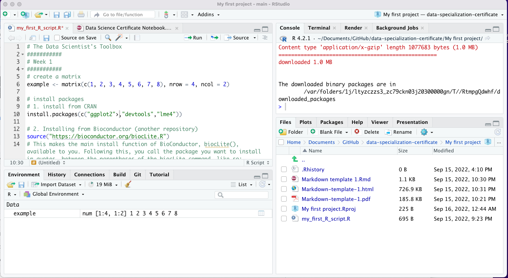

```{r setup, include=FALSE}
knitr::opts_chunk$set(echo = TRUE)
```

# Instruction

The Course Project is pretty straightforward. Now that you’ve learned about the basic tools found in the data scientist’s toolbox, we want to make sure that you’ve assembled those tools and are ready to begin using them. This easy project is your chance to demonstrate that you’ve done the basic software setup (R, RStudio, and Github) that will get you through the rest of the Data Science Specialization.

# Review Criteria

After you submit your work, your classmates will evaluate your submission by answering a series of yes/no questions about your work. You are also required to evaluate at least two of your classmates’ submissions.

# Question 1

+ Install R 
+ Install Rstudio
+ Open Rstudio and take a screenshot
+ Upload a screenshot of Rstudio open on your screen using one of these formats: png, jpg, gif, pdf
+ Be careful not to have personally identifiable or important information visible in the screen shot!

<br>
Answer:
<br>

```{r , echo=FALSE, fig.cap="Screen Shot of R-setup",  out.width='90%',fig.align='center'}

```

# Question 2 

+ Set up a Github account (you may use your own name or a pseudonym).
+ Create a repo called datasciencecoursera
+ Copy and paste the link to your GitHub account (or a direct link to your datasciencecoursera repo)

<br>
Answer:
<br>

The link: [datasciencecoursera][1]

# Question 3
+ Create a text file called HelloWorld.md
+ Add the line "## This is a markdown file" (without the quotation marks) to the document
+ Push the document to the datasciencecoursera repo you created on Github
+ Submit the link to the HelloWorld.md file on your Github repo.

<br>
Answer:
<br>

The link: [HelloWorld][2]

# Question 4

+ Fork the data sharing repository here: https://github.com/jtleek/datasharing
+ Copy and paste the link to the forked repository on your Github account.

<br>
Answer:
<br>

The link: [Forked Repository][3]

[1]: https://github.com/wei-haoyi/Coursera_Data_Science_Certificate
[2]: https://github.com/wei-haoyi/Coursera_Data_Science_Certificate/blob/main/1_The%20Data%20Scientist's%20Toolbox/HelloWorld.md
[3]: https://github.com/wei-haoyi/datasharing?organization=wei-haoyi&organization=wei-haoyi