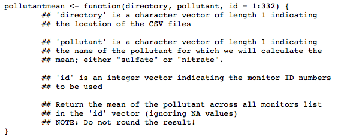
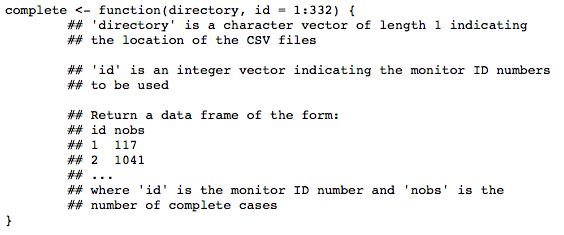
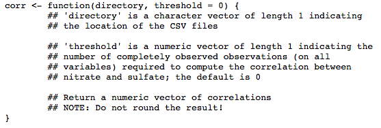

```{r setup, include=FALSE}
knitr::opts_chunk$set(echo = TRUE)
```

# Instruction

For this first programming assignment you will write three functions that are meant to interact with dataset that accompanies this assignment. The dataset is contained in a zip file specdata.zip that you can download from the Coursera web site. 

# Reviwe Criteria

Although this is a programming assignment, you will be assessed using a separate quiz.

# Part 1

Write a function named 'pollutantmean' that calculates the mean of a pollutant (sulfate or nitrate) across a specified list of monitors. The function 'pollutantmean' takes three arguments: 'directory', 'pollutant', and 'id'. Given a vector monitor ID numbers, 'pollutantmean' reads that monitors' particulate matter data from the directory specified in the 'directory' argument and returns the mean of the pollutant across all of the monitors, ignoring any missing values coded as NA. A prototype of the function is as follows

```{r , echo=FALSE, fig.cap="Example",  out.width='90%',fig.align='center'}

```

Answer:

```{r}
pollutantmean <- function(directory,pollutant, id=1:332) {

  full <-NA

  for (x in id){
    path <- paste("./","data/",directory,"/",sprintf("%.3d",x),".csv",sep="")
    rcsv <- read.csv(path)
    full<-rbind(full,rcsv)
  }

  x<-mean(full[,pollutant],na.rm=T)
  x
}
```

# Part 2

Write a function that reads a directory full of files and reports the number of completely observed cases in each data file. The function should return a data frame where the first column is the name of the file and the second column is the number of complete cases. A prototype of this function follows

```{r , echo=FALSE, fig.cap="Example",  out.width='90%',fig.align='center'}

```
Answer:
```{r}
library(dplyr)
complete <- function(directory, id=1:332){

  full <-NA

  for (x in id){
    path <- paste("./","data/",directory,"/",sprintf("%.3d",x),".csv",sep="")
    rcsv <- read.csv(path)
    full<-rbind(full,rcsv)
  }

  results <-full[complete.cases(full),] %>% # remove rows with missing values in any column of data frame.
    mutate(a=1) %>%
    group_by(ID) %>%
    mutate(nobs=sum(a)) %>%
    filter(row_number()==1) %>%
    ungroup() %>%
    select(ID,nobs) %>%
    relocate(ID,nobs)
  results
}

```

# Part 3

Write a function that takes a directory of data files and a threshold for complete cases and calculates the correlation between sulfate and nitrate for monitor locations where the number of completely observed cases (on all variables) is greater than the threshold. The function should return a vector of correlations for the monitors that meet the threshold requirement. If no monitors meet the threshold requirement, then the function should return a numeric vector of length 0. A prototype of this function follows

```{r , echo=FALSE, fig.cap="Example",  out.width='90%',fig.align='center'}

```
Answer:
```{r}
source("./DS2-HW1-complete.R")
corr <- function(directory, threshold=0){

  for (x in 1:332){
    path <- paste("./","data/",directory,"/",sprintf("%.3d",x),".csv",sep="")
    rcsv <- read.csv(path)
    full<-rbind(full,rcsv)
  }

  nobs <- complete(directory)

  full_nobs <- left_join(full,nobs, by="ID")

  results <-    full_nobs %>%
    group_by(ID) %>%
    mutate(correlation=cor(sulfate,nitrate,use="na.or.complete")) %>%
    filter(row_number()==1) %>%
    ungroup() %>%
    select(ID,nobs,correlation) %>%
    filter(nobs>threshold)

  vec <-results$correlation
}

```

