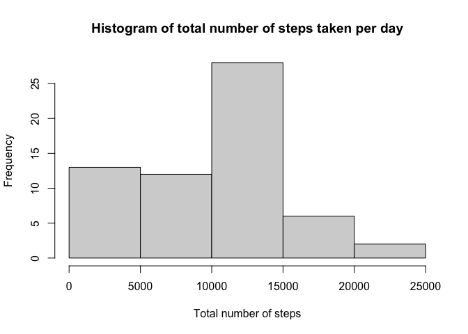
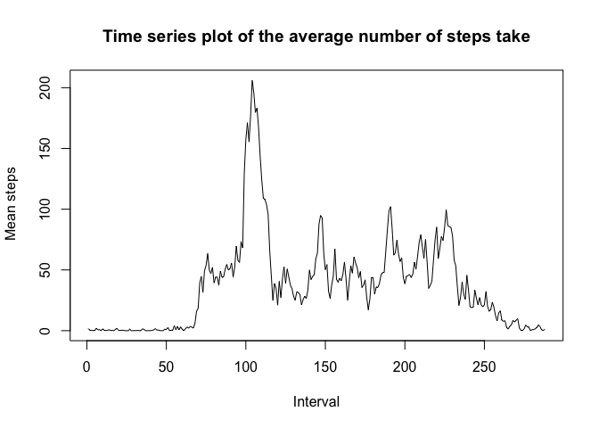
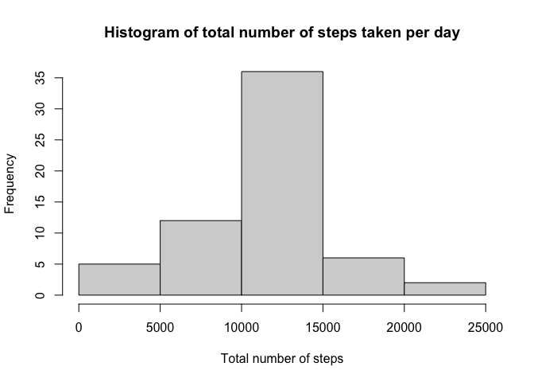
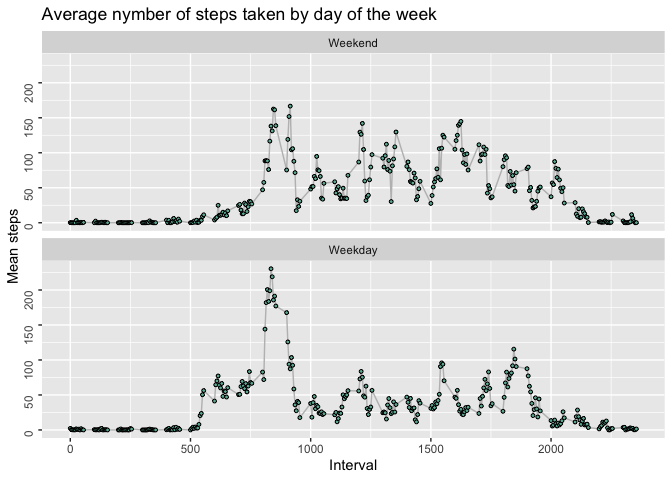

## Loading the data

    library(readr)
    activity <- read_csv("activity.csv")

    ## Rows: 17568 Columns: 3
    ## ── Column specification ────────────────────────────────────────────────────────
    ## Delimiter: ","
    ## dbl  (2): steps, interval
    ## date (1): date
    ## 
    ## ℹ Use `spec()` to retrieve the full column specification for this data.
    ## ℹ Specify the column types or set `show_col_types = FALSE` to quiet this message.

## Process the data

    activity$date <- as.Date(activity$date, format="%Y-%m-%d")

## What is mean total number of steps taken per day?

    # Calculate the total number of steps taken per day
    library(collapse)

    ## collapse 1.8.9, see ?`collapse-package` or ?`collapse-documentation`

    ## 
    ## Attaching package: 'collapse'

    ## The following object is masked from 'package:stats':
    ## 
    ##     D

    Totalsteps <- collap(activity, steps ~ date, FUN=list(sum), na.rm=T)

    # Make a histogram
    hist(Totalsteps$steps, main="Histogram of total number of steps taken per day", xlab="Total number of steps")

    # Calculate and report the mean and median of the otal number of steps taken per dapply
    summary(Totalsteps$steps)

    ##    Min. 1st Qu.  Median    Mean 3rd Qu.    Max. 
    ##       0    6778   10395    9354   12811   21194

## What is the average daily activity pattern?

    # make a time series plot of the 5-minute interval and the average number of steps taken, averaged across all days.
    Averagesteps <- collap(activity, steps ~ interval, FUN=list(mean), na.rm=T)
    plot(Averagesteps$steps, type="l", main="Time series plot of the average number of steps take", xlab="Interval", ylab=" Mean steps")

    #Which 5-minute interval, on average across all the days in the dataset contains the maximum number of steps?

    Averagesteps[Averagesteps$steps==max(Averagesteps$steps),][2]

    ## # A tibble: 1 × 1
    ##   interval
    ##      <dbl>
    ## 1      835

## Imputing missing values

    # Calculate and report the total number of missing values in the dataset (i.e. the total number of rows with NAs)
    library(dplyr)

    ## 
    ## Attaching package: 'dplyr'

    ## The following objects are masked from 'package:stats':
    ## 
    ##     filter, lag

    ## The following objects are masked from 'package:base':
    ## 
    ##     intersect, setdiff, setequal, union

    activity1 <- activity %>%
              mutate(x=case_when(rowSums(is.na(activity))!=0~1,T~0))
    sum(activity1$x)

    ## [1] 2304

    # Devise a strategy for filling in all of the missing values in the dataset. The strategy does not need to be sophisticated. For example, you could use the mean/median for that day, or the mean for that 5-minute interval, etc.
    # Create a new dataset that is equal to the original dataset but with the missing data filled in.

    # I use the mean for that 5-minute interveral
    activity2 <- left_join(activity1,Averagesteps,by="interval")
    activity2 <- activity2 %>%
              mutate(steps.x=coalesce(steps.x,steps.y))

    # Make a histogram of the total number of steps taken each day and Calculate and report the mean and median total number of steps taken per day. Do these values differ from the estimates from the first part of the assignment? What is the impact of imputing missing data on the estimates of the total daily number of steps?

    TotalstepsNA <- collap(activity2, steps.x ~ date, FUN=list(sum), na.rm=T)
    # Make a histogram
    hist(TotalstepsNA$steps.x, main="Histogram of total number of steps taken per day", xlab="Total number of steps")

    summary(Totalsteps$steps)

    ##    Min. 1st Qu.  Median    Mean 3rd Qu.    Max. 
    ##       0    6778   10395    9354   12811   21194

    summary(TotalstepsNA$steps.x)

    ##    Min. 1st Qu.  Median    Mean 3rd Qu.    Max. 
    ##      41    9819   10766   10766   12811   21194

Yes, mean and median total number of steps taken per day for the filled
in missing values differ from these of the origional dataset.

## Are there differences in activity patterns between weekdays and weekends?

    # Create a new factor variable in the dataset with two levels – “weekday” and “weekend” indicating whether a given date is a weekday or weekend day.

    activity2$week <- weekdays(activity2$date)
    activity2$weekend <- as.factor(grepl("S.+", activity2$week))

    levels(activity2$weekend) <- list(Weekend= "TRUE", Weekday="FALSE")

    # Make a panel plot containing a time series plot (i.e. type = "l") of the 5-minute interval (x-axis) and the average number of steps taken, averaged across all weekday days or weekend days (y-axis). See the README file in the GitHub repository to see an example of what this plot should look like using simulated data.

    WeekMean <- collap(activity2, steps.x ~ interval+weekend, FUN=list(mean), na.rm=T)

    library(ggplot2)
    g2 <- ggplot(WeekMean, aes(interval, steps.x))
    g2 +
              facet_wrap(~weekend, nrow=2) +
                        geom_line(color="grey") +
              geom_point(shape=21, color="black", fill="#69b3a2", size=1) +
              ggtitle("Average nymber of steps taken by day of the week") +
              labs(x="Interval", y="Mean steps") +
              theme(axis.text.y= element_text(angle=90, vjust=1, hjust=1))  # make the y lab vertical 

